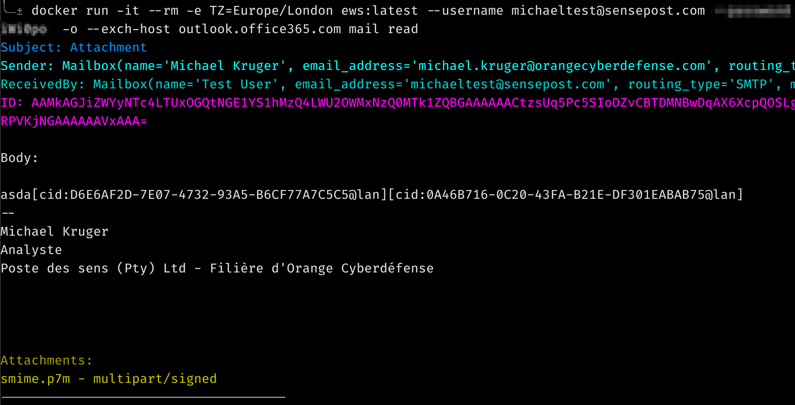

<h1 align="center">
  <br>
    📧 Thumbscr-EWS
  <br>
  <br>
</h1>

<h4 align="center">A wrapper around the amazing <a href="https://ecederstrand.github.io/exchangelib/">exchangelib</a> to do some common EWS operations.</h4>
<p align="center">
  <a href="https://twitter.com/_cablethief">
  <a href="https://hub.docker.com/r/cablethief/thumbscr-ews">
</p>
<br>

## Introduction

`thumbscr-ews` is a small Python utility used with Exchange Web Services. Using `thumbscr-ews`, it is possible to read and search through mail, retrieve the Global Address List, and download attachments. A lot of inspiration taken from [MailSniper](https://github.com/dafthack/MailSniper)

## Features

With `thumbscr-ews`, you can:

- Read emails. 
- Search for strings in emails. 
- Download attachments for emails. 
- Dump the GAL
- Check for delegated access.

Often times exchange is misconfigured allowing for EWS to bypass 2FA requirements. 

## Usage

Please see [Usage.md](USAGE.md).

## Installation - docker

A docker container for `thumbscr-ews` exists and can be used with:

```text
docker run --rm -ti cablethief/thumbscr-ews
```

If you do not want the docker to complain about timezones, set the TZ environment variable:

```text
docker run --rm -ti -e TZ=Europe/London cablethief/thumbscr-ews 
```

### Installation - Other

You can install locally using:

```
python setup.py install
```

# Pics




## Todo

 - Implement more MailSniper functions 
